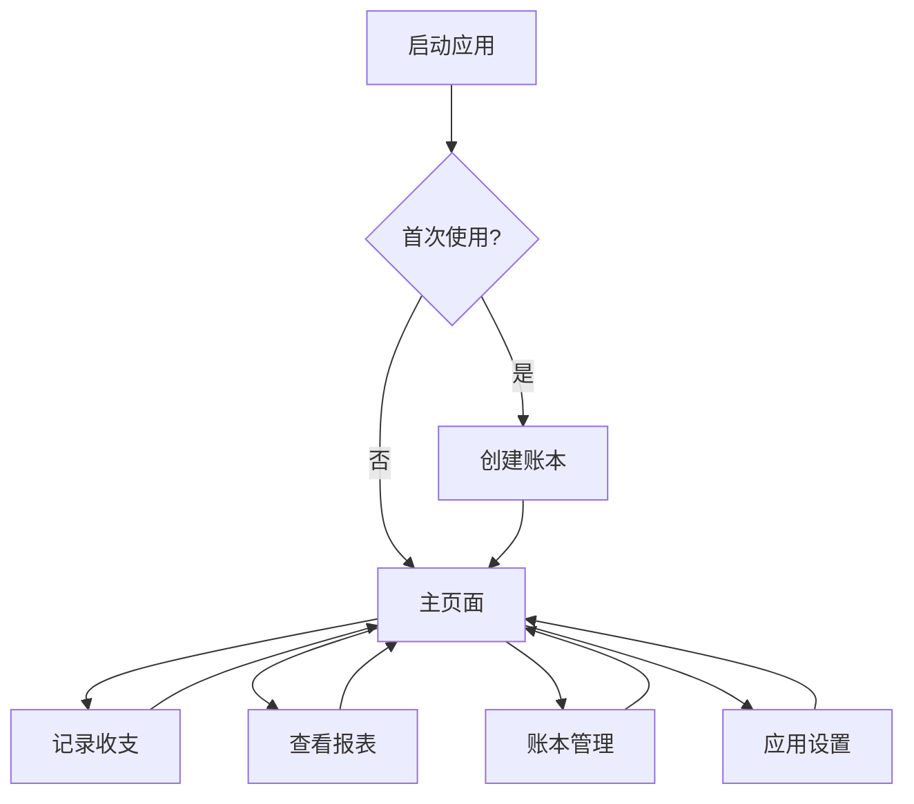

## 1. 产品概述

一个跨平台账本应用，支持Windows、macOS、iOS和Android平台，帮助用户轻松管理个人财务。用户可以随时随地记录收支、查看财务报表，数据安全存储在本地设备中。

## 2. 核心功能

### 2.1 用户角色

| 角色 | 注册方式 | 核心权限 |
|------|----------|----------|
| 普通用户 | 本地账户创建 | 创建账本、记录收支、查看报表、数据导出 |

### 2.2 功能模块

我们的账本应用包含以下主要页面：
1. **主页面**: 收支记录、快速添加、本月概览、导航菜单
2. **账本管理页面**: 账本列表、创建账本、切换账本、账本设置
3. **报表页面**: 收支统计、分类分析、趋势图表、导出功能
4. **设置页面**: 用户偏好、数据备份、关于应用

### 2.3 页面详情

| 页面名称 | 模块名称 | 功能描述 |
|----------|----------|----------|
| 主页面 | 快速记账 | 输入金额、选择分类、添加备注、保存记录 |
| 主页面 | 本月概览 | 显示本月收入、支出、结余、预算完成度 |
| 主页面 | 最近记录 | 显示最近交易记录列表、支持编辑和删除 |
| 主页面 | 导航菜单 | 底部导航栏（移动端）或侧边栏（桌面端） |
| 账本管理页面 | 账本列表 | 显示所有账本、当前选中账本高亮显示 |
| 账本管理页面 | 创建账本 | 输入账本名称、设置初始金额、选择币种 |
| 账本管理页面 | 账本设置 | 修改账本信息、删除账本、导出账本数据 |
| 报表页面 | 收支统计 | 按时间段统计收入支出总额 |
| 报表页面 | 分类分析 | 按分类统计支出占比、显示饼图 |
| 报表页面 | 趋势图表 | 显示收支趋势折线图、支持自定义时间范围 |
| 报表页面 | 导出功能 | 导出报表为PDF或Excel格式 |
| 设置页面 | 用户偏好 | 设置货币单位、语言、主题颜色 |
| 设置页面 | 数据备份 | 本地备份、恢复数据、自动备份设置 |
| 设置页面 | 关于应用 | 显示版本信息、使用条款、隐私政策 |

## 3. 核心流程

用户首次打开应用时，可以选择创建新账本或导入现有数据。日常使用中，用户通过主页面快速记录收支，应用会自动计算并显示财务概览。用户可以随时查看详细的报表分析，了解消费习惯和财务状况。所有数据都安全存储在设备的本地沙盒中。

## 4. 用户界面设计

### 4.1 设计风格
- **主色调**: 深绿色 (#10B981) - 代表财富和成长
- **辅助色**: 浅灰色 (#F3F4F6) - 背景色，深灰色 (#6B7280) - 文字色
- **按钮样式**: 圆角矩形，主要操作为实心按钮，次要操作为边框按钮
- **字体**: 系统默认字体，标题18-24px，正文14-16px
- **布局风格**: 卡片式布局，清晰的信息层级
- **图标风格**: 简洁的线性图标，使用Tabler Icons或类似图标库

### 4.2 页面设计概览

| 页面名称 | 模块名称 | UI元素 |
|----------|----------|--------|
| 主页面 | 快速记账 | 大数字键盘、分类图标网格、备注输入框、保存按钮 |
| 主页面 | 本月概览 | 卡片显示收入/支出/结余、进度条显示预算完成度 |
| 主页面 | 最近记录 | 交易列表项包含图标、分类、金额、时间、滑动操作 |
| 主页面 | 导航菜单 | 底部4个标签（主页/报表/账本/设置）或侧边栏 |
| 账本管理页面 | 账本列表 | 卡片式列表、当前账本高亮、长按操作菜单 |
| 报表页面 | 分类分析 | 彩色饼图、图例说明、百分比显示 |
| 设置页面 | 用户偏好 | 开关组件、下拉选择、输入框 |

### 4.3 响应式设计
- **桌面端优先**: 针对大屏幕优化，支持窗口缩放
- **移动端适配**: 支持iOS和Android原生体验
- **触摸交互**: 针对移动设备优化触摸区域大小（最小44px）
- **手势支持**: 滑动删除、长按菜单、下拉刷新
- **平台差异**: 
  - 桌面端：侧边导航栏、右键菜单、键盘快捷键
  - 移动端：底部标签栏、手势操作、原生分享

### 4.4 跨平台特性
- **统一UI**: 使用React组件确保各平台视觉一致性
- **原生功能**: 通过Capacitor调用设备原生功能（分享、通知等）
- **数据同步**: 本地存储优先，支持可选的云同步
- **离线使用**: 完全支持离线操作，数据本地持久化