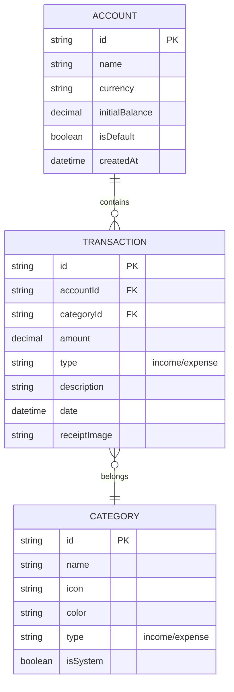

## 1. 架构设计

```mermaid
graph TD
  A[用户设备] --> B{平台检测}
  B -->|桌面端| C[Electron + React]
  B -->|移动端| D[Capacitor + React WebView]
  
  C --> E[StorageAdapter - Desktop]
  D --> F[StorageAdapter - Mobile]
  
  E --> G[better-sqlite3]
  F --> H[@capacitor-community/sqlite]
  
  I[React组件层] --> C
  I --> D
  
  subgraph "前端层"
    I
    C
    D
  end
  
  subgraph "存储适配器层"
    E
    F
  end
  
  subgraph "数据存储层"
    G
    H
  end
```

## 2. 技术描述

- **前端框架**: React@18 + TypeScript + Vite
- **初始化工具**: vite-init
- **UI框架**: TailwindCSS@3 + HeadlessUI
- **状态管理**: Zustand
- **移动端**: Capacitor@5 (Ionic团队维护的跨平台解决方案)
- **桌面端**: Electron@27
- **数据库**: 
  - 桌面端: better-sqlite3 (高性能原生SQLite)
  - 移动端: @capacitor-community/sqlite (Capacitor SQLite插件)
- **图标库**: Tabler Icons
- **图表库**: Chart.js + react-chartjs-2
- **日期处理**: date-fns
- **表单验证**: React Hook Form + Zod

## 3. 路由定义

| 路由 | 用途 |
|------|------|
| / | 主页面，显示记账界面和本月概览 |
| /reports | 报表页面，显示收支统计和分析图表 |
| /accounts | 账本管理页面，管理多个账本 |
| /settings | 设置页面，用户偏好和应用设置 |
| /add-transaction | 添加交易记录页面（移动端全屏模式） |
| /edit-transaction/:id | 编辑交易记录页面 |

## 4. 存储架构设计

### 4.1 StorageAdapter模式

```typescript
interface StorageAdapter {
  // 账本相关
  createAccount(account: Account): Promise<void>
  getAccounts(): Promise<Account[]>
  updateAccount(account: Account): Promise<void>
  deleteAccount(id: string): Promise<void>
  
  // 交易记录相关
  createTransaction(transaction: Transaction): Promise<void>
  getTransactions(accountId: string, options?: QueryOptions): Promise<Transaction[]>
  updateTransaction(transaction: Transaction): Promise<void>
  deleteTransaction(id: string): Promise<void>
  
  // 分类相关
  getCategories(): Promise<Category[]>
  createCategory(category: Category): Promise<void>
  
  // 备份和恢复
  exportData(): Promise<BackupData>
  importData(data: BackupData): Promise<void>
}
```

### 4.2 平台实现

**桌面端实现 (DesktopStorageAdapter)**
```typescript
class DesktopStorageAdapter implements StorageAdapter {
  private db: Database
  
  constructor() {
    // 通过Electron IPC与主进程通信
    this.db = new Database(app.getPath('userData') + '/easyLedger.db')
    this.initializeTables()
  }
  
  // 实现所有存储方法...
}
```

**移动端实现 (MobileStorageAdapter)**
```typescript
class MobileStorageAdapter implements StorageAdapter {
  private db: SQLiteDBConnection
  
  async initialize() {
    const sqlite = new SQLiteConnection(CapacitorSQLite)
    this.db = await sqlite.createConnection('easyLedger', false, 'no-encryption', 1)
    await this.db.open()
    await this.initializeTables()
  }
  
  // 实现所有存储方法...
}
```

## 5. 数据模型

### 5.1 数据模型定义



### 5.2 数据库表结构

账本表 (accounts)
```sql
CREATE TABLE accounts (
  id TEXT PRIMARY KEY,
  name TEXT NOT NULL,
  currency TEXT DEFAULT 'CNY',
  initial_balance DECIMAL(12,2) DEFAULT 0,
  is_default BOOLEAN DEFAULT 0,
  created_at DATETIME DEFAULT CURRENT_TIMESTAMP,
  updated_at DATETIME DEFAULT CURRENT_TIMESTAMP
);
```

交易记录表 (transactions)
```sql
CREATE TABLE transactions (
  id TEXT PRIMARY KEY,
  account_id TEXT NOT NULL,
  category_id TEXT NOT NULL,
  amount DECIMAL(12,2) NOT NULL,
  type TEXT CHECK(type IN ('income', 'expense')) NOT NULL,
  description TEXT,
  date DATETIME NOT NULL,
  receipt_image TEXT,
  created_at DATETIME DEFAULT CURRENT_TIMESTAMP,
  updated_at DATETIME DEFAULT CURRENT_TIMESTAMP,
  FOREIGN KEY (account_id) REFERENCES accounts(id),
  FOREIGN KEY (category_id) REFERENCES categories(id)
);

CREATE INDEX idx_transactions_account_date ON transactions(account_id, date);
CREATE INDEX idx_transactions_date ON transactions(date);
```

分类表 (categories)
```sql
CREATE TABLE categories (
  id TEXT PRIMARY KEY,
  name TEXT NOT NULL,
  icon TEXT NOT NULL,
  color TEXT NOT NULL,
  type TEXT CHECK(type IN ('income', 'expense')) NOT NULL,
  is_system BOOLEAN DEFAULT 0,
  created_at DATETIME DEFAULT CURRENT_TIMESTAMP
);

-- 初始化系统分类
INSERT INTO categories (id, name, icon, color, type, is_system) VALUES
('food', '餐饮', 'utensils', '#EF4444', 'expense', 1),
('transport', '交通', 'car', '#3B82F6', 'expense', 1),
('shopping', '购物', 'shopping-bag', '#F59E0B', 'expense', 1),
('salary', '工资', 'currency-dollar', '#10B981', 'income', 1);
```

## 6. 跨平台构建配置

### 6.1 Capacitor配置 (capacitor.config.ts)
```typescript
const config: CapacitorConfig = {
  appId: 'com.easyleger.app',
  appName: 'EasyLedger',
  webDir: 'dist',
  bundledWebRuntime: false,
  plugins: {
    SplashScreen: {
      launchShowDuration: 2000,
      launchAutoHide: true,
      backgroundColor: '#10B981'
    }
  }
}
```

### 6.2 Electron配置
```typescript
// electron-builder配置
{
  "appId": "com.easyleger.app",
  "productName": "EasyLedger",
  "directories": {
    "output": "dist-electron"
  },
  "files": [
    "dist/**/*",
    "electron/**/*"
  ],
  "mac": {
    "category": "public.app-category.finance"
  },
  "win": {
    "target": "nsis"
  }
}
```

## 7. 部署策略

- **移动端**: 
  - iOS: App Store发布
  - Android: Google Play Store和各大应用市场
- **桌面端**:
  - macOS: DMG安装包
  - Windows: EXE安装包
  - Linux: AppImage或Snap包
- **Web端**: 可选的PWA版本，用于快速访问和演示